# Đặc Tả UML – Các Chức Năng Của Du Khách
## Dự án: VinhKhanhTour (.NET MAUI)

Tài liệu này đặc tả **sơ đồ Use Case**, **bảng đặc tả từng Use Case** và **sơ đồ Sequence** cho vai trò **Du Khách**, xây dựng trực tiếp dựa trên mã nguồn C# của dự án.

---

## A. SƠ ĐỒ USE CASE TỔNG QUÁT

**Actor duy nhất:** Du Khách (người dùng cuối sử dụng App)

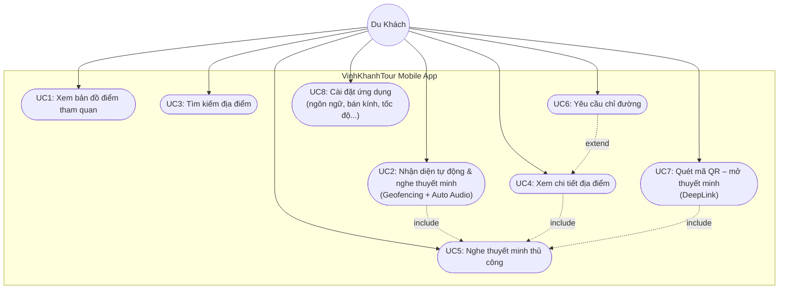
```mermaid
flowchart TB
    Actor((Du Khách))

    subgraph App[VinhKhanhTour Mobile App]
        UC1(["UC1: Xem bản đồ điểm tham quan"])
        UC2(["UC2: Nhận diện tự động & nghe thuyết minh\n(Geofencing + Auto Audio)"])
        UC3(["UC3: Tìm kiếm địa điểm"])
        UC4(["UC4: Xem chi tiết địa điểm"])
        UC5(["UC5: Nghe thuyết minh thủ công"])
        UC6(["UC6: Yêu cầu chỉ đường"])
        UC7(["UC7: Quét mã QR – mở thuyết minh\n(DeepLink)"])
        UC8(["UC8: Cài đặt ứng dụng\n(ngôn ngữ, bán kính, tốc độ...)"])
    end

    Actor --> UC1
    Actor --> UC2
    Actor --> UC3
    Actor --> UC4
    Actor --> UC5
    Actor --> UC6
    Actor --> UC7
    Actor --> UC8

    UC2 -.->|include| UC5
    UC4 -.->|include| UC5
    UC7 -.->|include| UC5
    UC6 -.->|extend| UC4
```

---

## A.2. SƠ ĐỒ USE CASE CHI TIẾT TỪNG CHỨC NĂNG

---

### UC1 – Xem Bản Đồ Điểm Tham Quan

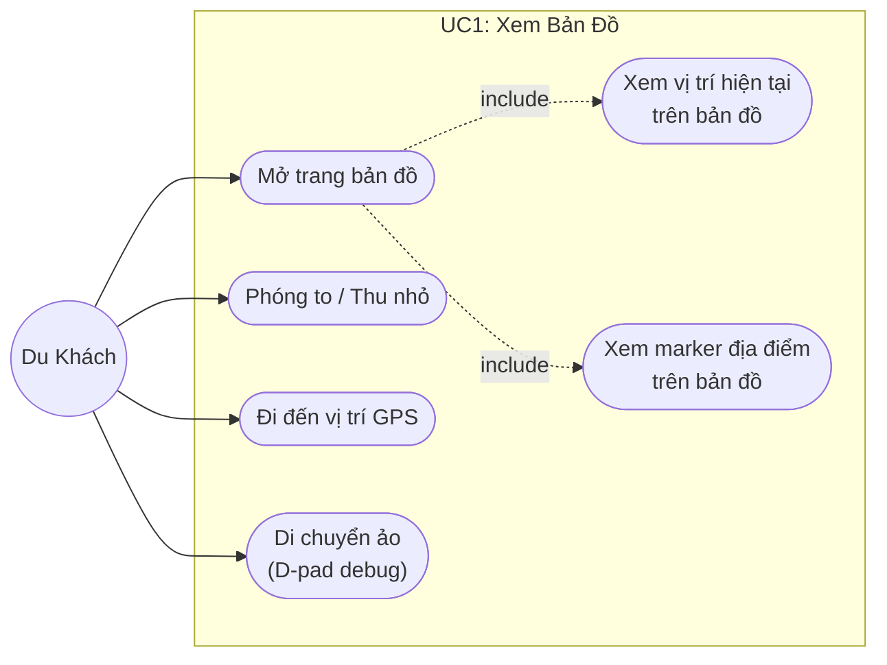
```mermaid
flowchart LR
    U((Du Khách))

    subgraph UC1[UC1: Xem Bản Đồ]
        A1(["Mở trang bản đồ"])
        A2(["Xem vị trí hiện tại\ntrên bản đồ"])
        A3(["Phóng to / Thu nhỏ"])
        A4(["Đi đến vị trí GPS"])
        A5(["Xem marker địa điểm\ntrên bản đồ"])
        A6(["Di chuyển ảo\n(D-pad debug)"])
    end

    U --> A1
    A1 -.->|include| A5
    A1 -.->|include| A2
    U --> A3
    U --> A4
    U --> A6
```

---

### UC2 – Nhận Diện Tự Động & Nghe Thuyết Minh (Geofencing)

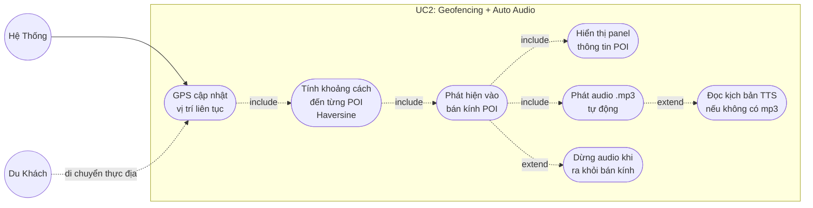
```mermaid
flowchart LR
    U((Du Khách))
    SYS((Hệ Thống))

    subgraph UC2[UC2: Geofencing + Auto Audio]
        B1(["GPS cập nhật\nvị trí liên tục"])
        B2(["Tính khoảng cách\nđến từng POI\nHaversine"])
        B3(["Phát hiện vào\nbán kính POI"])
        B4(["Hiển thị panel\nthông tin POI"])
        B5(["Phát audio .mp3\ntự động"])
        B6(["Đọc kịch bản TTS\nnếu không có mp3"])
        B7(["Dừng audio khi\nra khỏi bán kính"])
    end

    SYS --> B1
    B1 -.->|include| B2
    B2 -.->|include| B3
    B3 -.->|include| B4
    B3 -.->|include| B5
    B5 -.->|extend| B6
    B3 -.->|extend| B7

    U -.->|di chuyển thực địa| B1
```

---

### UC3 – Tìm Kiếm Địa Điểm

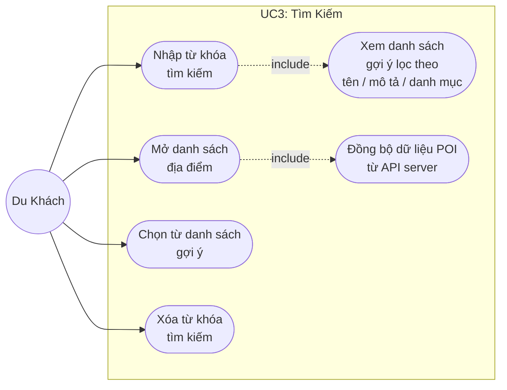
```mermaid
flowchart LR
    U((Du Khách))

    subgraph UC3[UC3: Tìm Kiếm]
        C1(["Mở danh sách\nđịa điểm"])
        C2(["Nhập từ khóa\ntìm kiếm"])
        C3(["Xem danh sách\ngợi ý lọc theo\ntên / mô tả / danh mục"])
        C4(["Chọn từ danh sách\ngợi ý"])
        C5(["Xóa từ khóa\ntìm kiếm"])
        C6(["Đồng bộ dữ liệu POI\ntừ API server"])
    end

    U --> C1
    C1 -.->|include| C6
    U --> C2
    C2 -.->|include| C3
    U --> C4
    U --> C5
```

---

### UC4 – Xem Chi Tiết Địa Điểm

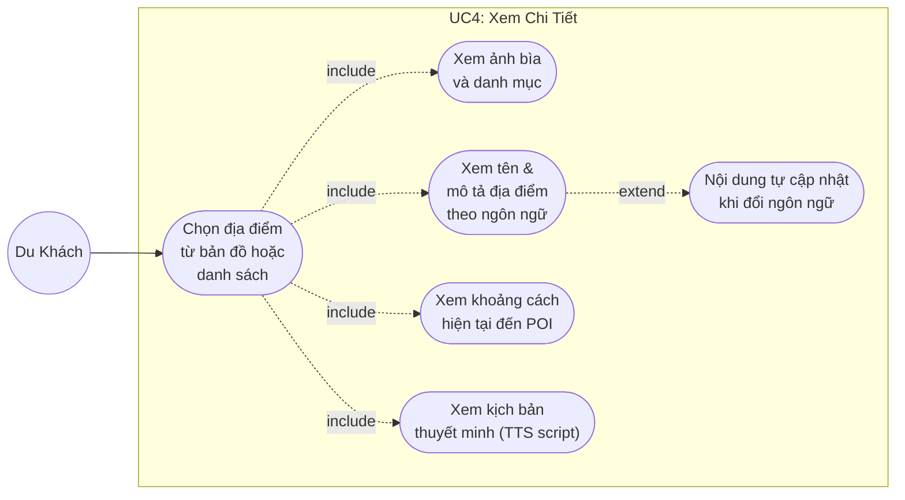
```mermaid
flowchart LR
    U((Du Khách))

    subgraph UC4[UC4: Xem Chi Tiết]
        D1(["Chọn địa điểm\ntừ bản đồ hoặc\ndanh sách"])
        D2(["Xem ảnh bìa\nvà danh mục"])
        D3(["Xem tên &\nmô tả địa điểm\ntheo ngôn ngữ"])
        D4(["Xem khoảng cách\nhiện tại đến POI"])
        D5(["Xem kịch bản\nthuyết minh (TTS script)"])
        D6(["Nội dung tự cập nhật\nkhi đổi ngôn ngữ"])
    end

    U --> D1
    D1 -.->|include| D2
    D1 -.->|include| D3
    D1 -.->|include| D4
    D1 -.->|include| D5
    D3 -.->|extend| D6
```

---

### UC5 – Nghe Thuyết Minh Thủ Công

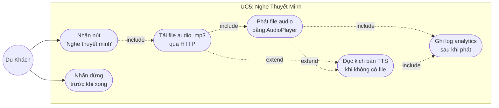
```mermaid
flowchart LR
    U((Du Khách))

    subgraph UC5[UC5: Nghe Thuyết Minh]
        E1(["Nhấn nút\n'Nghe thuyết minh'"])
        E2(["Tải file audio .mp3\nqua HTTP"])
        E3(["Phát file audio\nbằng AudioPlayer"])
        E4(["Đọc kịch bản TTS\nkhi không có file"])
        E5(["Nhấn dừng\ntrước khi xong"])
        E6(["Ghi log analytics\nsau khi phát"])
    end

    U --> E1
    E1 -.->|include| E2
    E2 -.->|include| E3
    E2 -.->|extend| E4
    E3 -.->|extend| E4
    U --> E5
    E3 -.->|include| E6
    E4 -.->|include| E6
```

---

### UC6 – Yêu Cầu Chỉ Đường

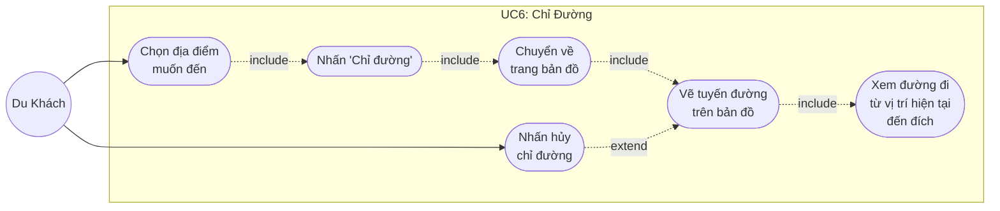
```mermaid
flowchart LR
    U((Du Khách))

    subgraph UC6[UC6: Chỉ Đường]
        F1(["Chọn địa điểm\nmuốn đến"])
        F2(["Nhấn 'Chỉ đường'"])
        F3(["Chuyển về\ntrang bản đồ"])
        F4(["Vẽ tuyến đường\ntrên bản đồ"])
        F5(["Xem đường đi\ntừ vị trí hiện tại\nđến đích"])
        F6(["Nhấn hủy\nchỉ đường"])
    end

    U --> F1
    F1 -.->|include| F2
    F2 -.->|include| F3
    F3 -.->|include| F4
    F4 -.->|include| F5
    U --> F6
    F6 -.->|extend| F4
```

---

### UC7 – Quét Mã QR & Mở Thuyết Minh (DeepLink)

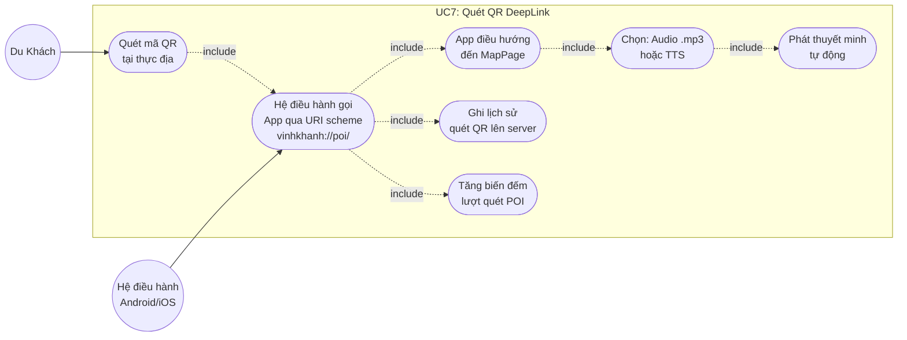
```mermaid
flowchart LR
    U((Du Khách))
    OS((Hệ điều hành\nAndroid/iOS))

    subgraph UC7[UC7: Quét QR DeepLink]
        G1(["Quét mã QR\ntại thực địa"])
        G2(["Hệ điều hành gọi\nApp qua URI scheme\nvinhkhanh://poi/"])
        G3(["App điều hướng\nđến MapPage"])
        G4(["Chọn: Audio .mp3\nhoặc TTS"])
        G5(["Phát thuyết minh\ntự động"])
        G6(["Ghi lịch sử\nquét QR lên server"])
        G7(["Tăng biến đếm\nlượt quét POI"])
    end

    U --> G1
    G1 -.->|include| G2
    OS --> G2
    G2 -.->|include| G3
    G3 -.->|include| G4
    G4 -.->|include| G5
    G2 -.->|include| G6
    G2 -.->|include| G7
```

---

### UC8 – Cài Đặt Ứng Dụng

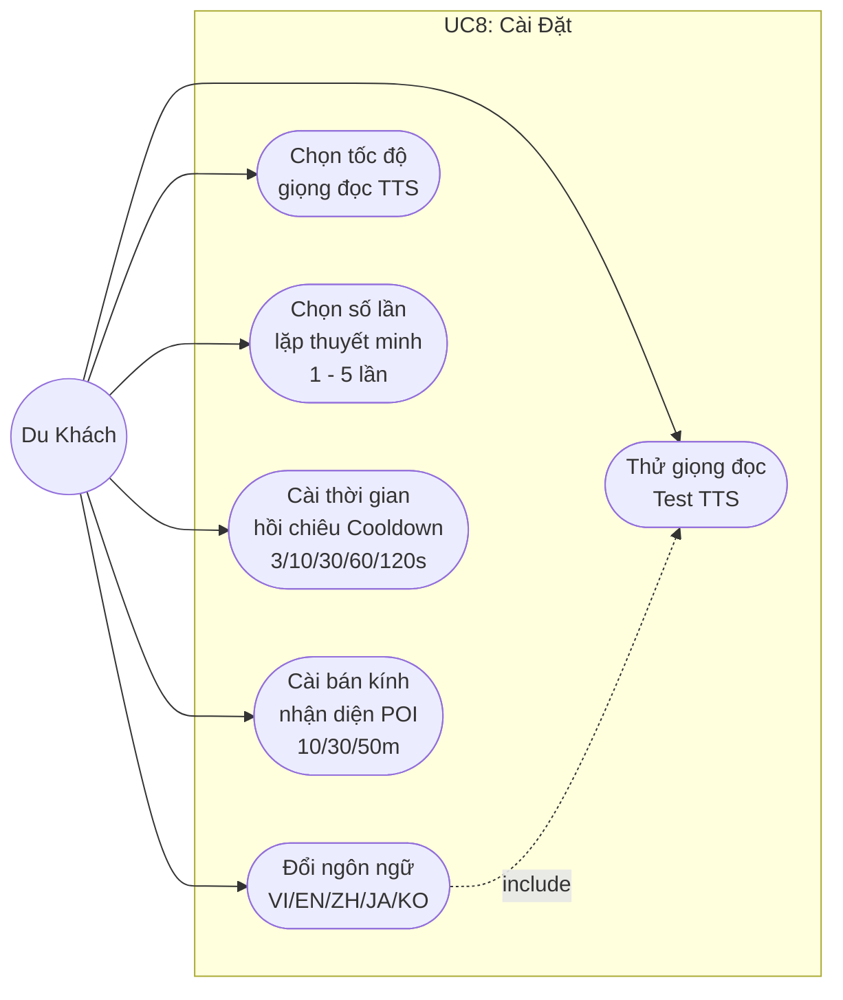
```mermaid
flowchart LR
    U((Du Khách))

    subgraph UC8[UC8: Cài Đặt]
        H1(["Đổi ngôn ngữ\nVI/EN/ZH/JA/KO"])
        H2(["Chọn tốc độ\ngiọng đọc TTS"])
        H3(["Chọn số lần\nlặp thuyết minh\n1 - 5 lần"])
        H4(["Cài thời gian\nhồi chiêu Cooldown\n3/10/30/60/120s"])
        H5(["Cài bán kính\nnhận diện POI\n10/30/50m"])
        H6(["Thử giọng đọc\nTest TTS"])
    end

    U --> H1
    U --> H2
    U --> H3
    U --> H4
    U --> H5
    U --> H6
    H1 -.->|include| H6
```

---

## B. ĐẶC TẢ & SƠ ĐỒ SEQUENCE TỪNG USE CASE

---

## UC1: Xem Bản Đồ Điểm Tham Quan

### Đặc tả

| Trường | Nội dung |
|---|---|
| **Tên Use Case** | Xem bản đồ điểm tham quan |
| **Actor** | Du Khách |
| **Mô tả** | Du khách mở trang bản đồ để xem toàn bộ địa điểm tham quan trên bản đồ tương tác, phóng to thu nhỏ, xem vị trí hiện tại. |
| **Điều kiện tiền đề** | Ứng dụng đã khởi động, App đã cấp quyền GPS |
| **Luồng chính** | 1. Du khách nhấn tab "Bản đồ". 2. `MapPage` khởi tạo, `MapViewModel` tạo HTML bản đồ Leaflet. 3. WebView render bản đồ. 4. Ứng dụng gọi `StartTourCommand` → khởi động `GpsTrackingService`. 5. GPS cập nhật, `InjectMarkersUpdate()` vẽ marker địa điểm trên bản đồ. 6. Du khách có thể zoom in/out, nhấn vị trí của mình. |
| **Luồng ngoại lệ** | GPS không hoạt động → `ErrorOccurred` → App hiển thị thông báo lỗi. |

### Sơ đồ Sequence

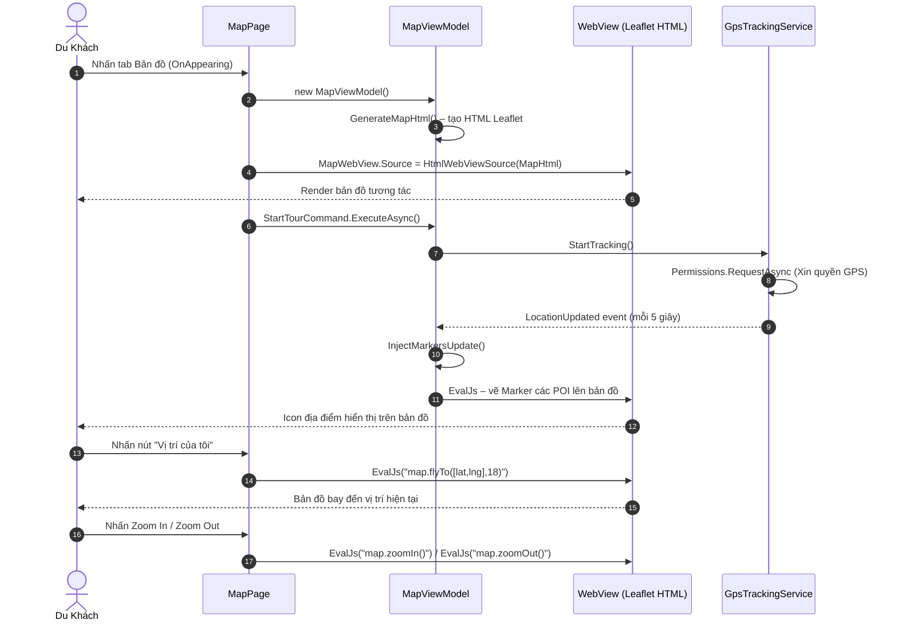
```mermaid
sequenceDiagram
    autonumber
    actor U as Du Khách
    participant MP as MapPage
    participant VM as MapViewModel
    participant WV as WebView (Leaflet HTML)
    participant GPS as GpsTrackingService

    U->>MP: Nhấn tab Bản đồ (OnAppearing)
    MP->>VM: new MapViewModel()
    VM->>VM: GenerateMapHtml() – tạo HTML Leaflet
    MP->>WV: MapWebView.Source = HtmlWebViewSource(MapHtml)
    WV-->>U: Render bản đồ tương tác

    MP->>VM: StartTourCommand.ExecuteAsync()
    VM->>GPS: StartTracking()
    GPS->>GPS: Permissions.RequestAsync (Xin quyền GPS)
    GPS-->>VM: LocationUpdated event (mỗi 5 giây)

    VM->>VM: InjectMarkersUpdate()
    VM->>WV: EvalJs – vẽ Marker các POI lên bản đồ
    WV-->>U: Icon địa điểm hiển thị trên bản đồ

    U->>MP: Nhấn nút "Vị trí của tôi"
    MP->>WV: EvalJs("map.flyTo([lat,lng],18)")
    WV-->>U: Bản đồ bay đến vị trí hiện tại

    U->>MP: Nhấn Zoom In / Zoom Out
    MP->>WV: EvalJs("map.zoomIn()") / EvalJs("map.zoomOut()")
```

---

## UC2: Nhận Diện Tự Động & Nghe Thuyết Minh (Geofencing)

### Đặc tả

| Trường | Nội dung |
|---|---|
| **Tên Use Case** | Nhận diện vị trí tự động và phát thuyết minh |
| **Actor** | Du Khách (gián tiếp) + Hệ thống (chủ động kích hoạt) |
| **Mô tả** | Khi du khách di chuyển vào vùng bán kính của một địa điểm (mặc định 30m), hệ thống tự động hiện panel thông tin và phát audio giới thiệu – không cần thao tác. |
| **Điều kiện tiền đề** | `GpsTrackingService` đang chạy, du khách đang ở trang bản đồ |
| **Luồng chính** | 1. GPS gửi tọa độ mới mỗi 5 giây. 2. `GeofenceService.CheckGeofences()` so sánh khoảng cách bằng công thức Haversine. 3. Nếu `DistanceFromUser ≤ GlobalRadius` → `TriggerWithDebounce()`. 4. Sau 3 giây debounce, sự kiện `PoiTriggered` được phát. 5. `MapViewModel` nhận → hiển thị Panel POI, gọi `AudioQueueService.Enqueue(poi)`. 6. `AudioQueueService` ưu tiên mp3, fallback TTS nếu không có file. |
| **Cooldown** | Sau khi phát xong, chờ `CooldownSeconds` (mặc định 10s) mới cho phép phát lại cùng POI đó. |
| **Luồng ngoại lệ** | Không có file mp3 → `FallbackTtsAsync()` đọc kịch bản TTS. Lỗi download → Fallback TTS tự động. |

### Sơ đồ Sequence

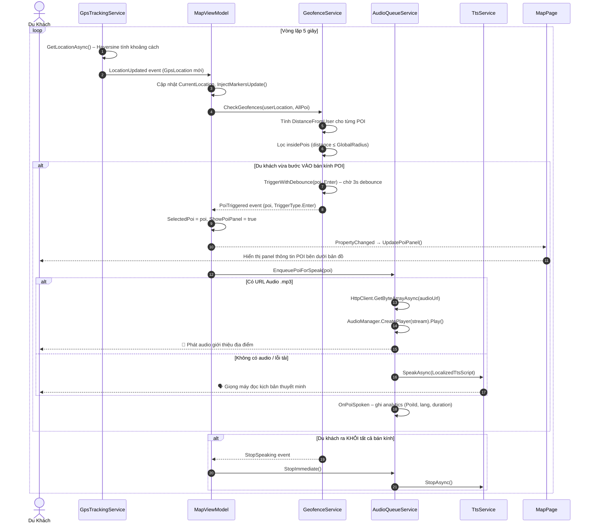
```mermaid
sequenceDiagram
    autonumber
    actor U as Du Khách
    participant GPS as GpsTrackingService
    participant VM as MapViewModel
    participant GEO as GeofenceService
    participant AUD as AudioQueueService
    participant TTS as TtsService
    participant MP as MapPage

    loop Vòng lặp 5 giây
        GPS->>GPS: GetLocationAsync() – Haversine tính khoảng cách
        GPS->>VM: LocationUpdated event (GpsLocation mới)
        VM->>VM: Cập nhật CurrentLocation, InjectMarkersUpdate()

        VM->>GEO: CheckGeofences(userLocation, AllPoi)
        GEO->>GEO: Tính DistanceFromUser cho từng POI
        GEO->>GEO: Lọc insidePois (distance ≤ GlobalRadius)

        alt Du khách vừa bước VÀO bán kính POI
            GEO->>GEO: TriggerWithDebounce(poi, Enter) – chờ 3s debounce
            GEO-->>VM: PoiTriggered event (poi, TriggerType.Enter)
            VM->>VM: SelectedPoi = poi, ShowPoiPanel = true
            VM-->>MP: PropertyChanged → UpdatePoiPanel()
            MP-->>U: Hiển thị panel thông tin POI bên dưới bản đồ
            VM->>AUD: EnqueuePoiForSpeak(poi)

            alt Có URL Audio .mp3
                AUD->>AUD: HttpClient.GetByteArrayAsync(audioUrl)
                AUD->>AUD: AudioManager.CreatePlayer(stream).Play()
                AUD-->>U: 🎵 Phát audio giới thiệu địa điểm
            else Không có audio / lỗi tải
                AUD->>TTS: SpeakAsync(LocalizedTtsScript)
                TTS-->>U: 🗣️ Giọng máy đọc kịch bản thuyết minh
            end

            AUD->>AUD: OnPoiSpoken – ghi analytics (PoiId, lang, duration)
        end

        alt Du khách ra KHỎI tất cả bán kính
            GEO-->>VM: StopSpeaking event
            VM->>AUD: StopImmediate()
            AUD->>TTS: StopAsync()
        end
    end
```

---

## UC3: Tìm Kiếm Địa Điểm

### Đặc tả

| Trường | Nội dung |
|---|---|
| **Tên Use Case** | Tìm kiếm địa điểm |
| **Actor** | Du Khách |
| **Mô tả** | Du khách nhập từ khóa trên trang Danh Sách để lọc theo tên, mô tả hoặc danh mục địa điểm. |
| **Điều kiện tiền đề** | `PoiListPage` đã mở, danh sách POI đã nạp |
| **Luồng chính** | 1. Du khách gõ từ khóa vào `SearchEntry`. 2. `OnSearchTextChanged` → lọc `_allPoi` theo `Name`, `LocalizedName`, `Description`, `Category`. 3. Panel gợi ý `SuggestionPanel` hiện ra. 4. Du khách chọn gợi ý → `OnSuggestionTapped`. 5. Hoặc nhấn "X" xóa để quay về danh sách đầy đủ. |
| **Luồng ngoại lệ** | Từ khóa rỗng → ẩn gợi ý, hiện lại danh sách đầy đủ. |

### Sơ đồ Sequence

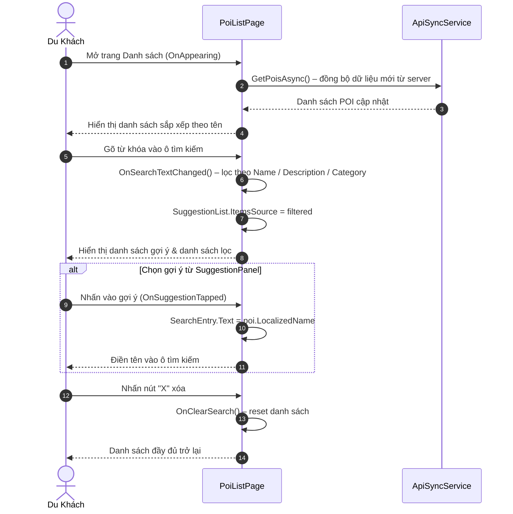
```mermaid
sequenceDiagram
    autonumber
    actor U as Du Khách
    participant LP as PoiListPage
    participant API as ApiSyncService

    U->>LP: Mở trang Danh sách (OnAppearing)
    LP->>API: GetPoisAsync() – đồng bộ dữ liệu mới từ server
    API-->>LP: Danh sách POI cập nhật
    LP-->>U: Hiển thị danh sách sắp xếp theo tên

    U->>LP: Gõ từ khóa vào ô tìm kiếm
    LP->>LP: OnSearchTextChanged() – lọc theo Name / Description / Category
    LP->>LP: SuggestionList.ItemsSource = filtered
    LP-->>U: Hiển thị danh sách gợi ý & danh sách lọc

    alt Chọn gợi ý từ SuggestionPanel
        U->>LP: Nhấn vào gợi ý (OnSuggestionTapped)
        LP->>LP: SearchEntry.Text = poi.LocalizedName
        LP-->>U: Điền tên vào ô tìm kiếm
    end

    U->>LP: Nhấn nút "X" xóa
    LP->>LP: OnClearSearch() – reset danh sách
    LP-->>U: Danh sách đầy đủ trở lại
```

---

## UC4: Xem Chi Tiết Địa Điểm

### Đặc tả

| Trường | Nội dung |
|---|---|
| **Tên Use Case** | Xem chi tiết địa điểm |
| **Actor** | Du Khách |
| **Mô tả** | Du khách xem thông tin đầy đủ của một địa điểm: ảnh bìa, danh mục, khoảng cách, mô tả, kịch bản thuyết minh. |
| **Điều kiện tiền đề** | Du khách đã chọn một địa điểm từ danh sách hoặc từ panel bản đồ |
| **Luồng chính** | 1. Du khách nhấn "Chi tiết" từ danh sách hoặc panel bản đồ → `Navigation.PushAsync(new PoiDetailPage(poi))`. 2. `PoiDetailPage` khởi tạo với `PoiModel`. 3. `BindData()` load ảnh bìa, khoảng cách, thông tin. 4. `RefreshLocalizedText()` hiển thị nội dung theo ngôn ngữ hiện tại. 5. Du khách đọc thông tin chi tiết. |

### Sơ đồ Sequence

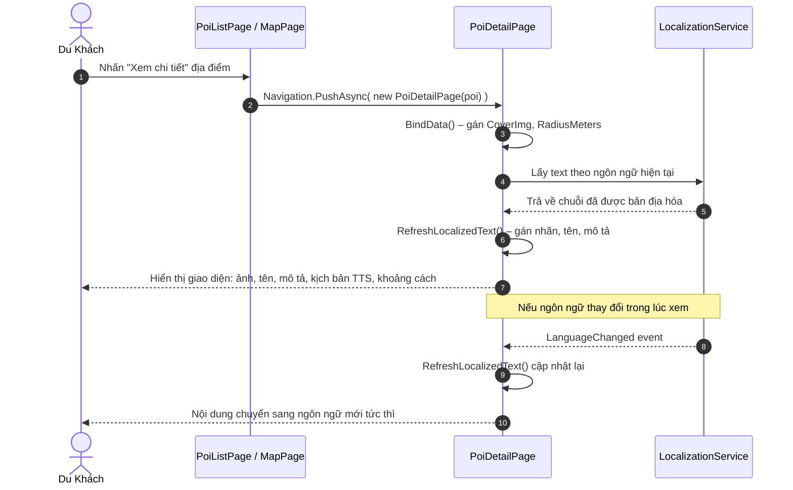
```mermaid
sequenceDiagram
    autonumber
    actor U as Du Khách
    participant LP as PoiListPage / MapPage
    participant DP as PoiDetailPage
    participant LOC as LocalizationService

    U->>LP: Nhấn "Xem chi tiết" địa điểm
    LP->>DP: Navigation.PushAsync( new PoiDetailPage(poi) )
    DP->>DP: BindData() – gán CoverImg, RadiusMeters
    DP->>LOC: Lấy text theo ngôn ngữ hiện tại
    LOC-->>DP: Trả về chuỗi đã được bản địa hóa
    DP->>DP: RefreshLocalizedText() – gán nhãn, tên, mô tả
    DP-->>U: Hiển thị giao diện: ảnh, tên, mô tả, kịch bản TTS, khoảng cách

    Note over DP,LOC: Nếu ngôn ngữ thay đổi trong lúc xem
    LOC-->>DP: LanguageChanged event
    DP->>DP: RefreshLocalizedText() cập nhật lại
    DP-->>U: Nội dung chuyển sang ngôn ngữ mới tức thì
```

---

## UC5: Nghe Thuyết Minh Thủ Công

### Đặc tả

| Trường | Nội dung |
|---|---|
| **Tên Use Case** | Nghe thuyết minh thủ công |
| **Actor** | Du Khách |
| **Mô tả** | Du khách chủ động nhấn nút để nghe bài giới thiệu địa điểm bằng file audio hoặc giọng đọc máy TTS. |
| **Điều kiện tiền đề** | Đang ở trang `PoiDetailPage` |
| **Luồng chính** | 1. Du khách nhấn nút "Nghe thuyết minh". 2. Nếu có `LocalizedAudioUrl` → tải file mp3 qua HTTP. 3. Tạo `AudioManager.CreatePlayer(stream)` và `Play()`. 4. Chờ phát xong (polling 200ms) hoặc du khách nhấn "Dừng". 5. Sau khi kết thúc → gọi `ApiSyncService.LogPoiPlayAsync()` ghi analytics. |
| **Luồng ngoại lệ** | File rỗng hoặc lỗi mạng → `FallbackTtsAsync()` đọc `LocalizedTtsScript`. Không có file lẫn kịch bản → hiển thị cảnh báo `DisplayAlert`. |

### Sơ đồ Sequence

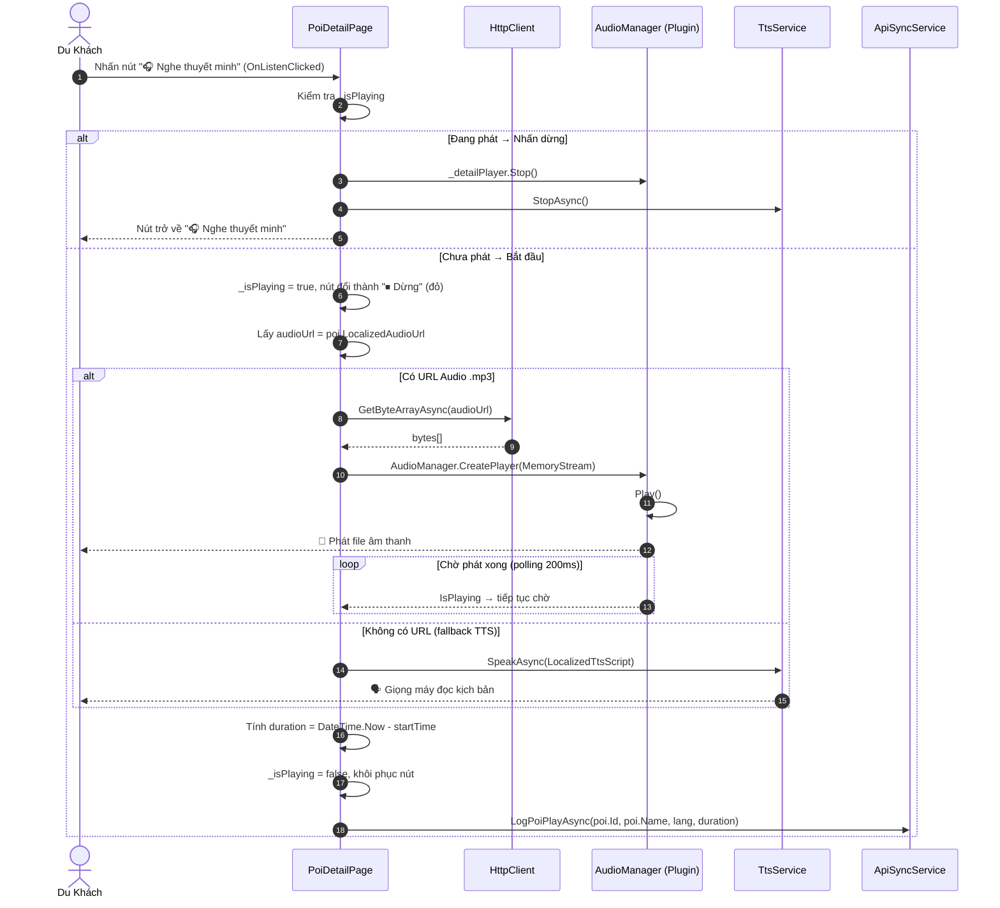
```mermaid
sequenceDiagram
    autonumber
    actor U as Du Khách
    participant DP as PoiDetailPage
    participant HTTP as HttpClient
    participant AUD as AudioManager (Plugin)
    participant TTS as TtsService
    participant API as ApiSyncService

    U->>DP: Nhấn nút "🎧 Nghe thuyết minh" (OnListenClicked)
    DP->>DP: Kiểm tra _isPlaying

    alt Đang phát → Nhấn dừng
        DP->>AUD: _detailPlayer.Stop()
        DP->>TTS: StopAsync()
        DP-->>U: Nút trở về "🎧 Nghe thuyết minh"
    else Chưa phát → Bắt đầu
        DP->>DP: _isPlaying = true, nút đổi thành "⏹ Dừng" (đỏ)
        DP->>DP: Lấy audioUrl = poi.LocalizedAudioUrl

        alt Có URL Audio .mp3
            DP->>HTTP: GetByteArrayAsync(audioUrl)
            HTTP-->>DP: bytes[]
            DP->>AUD: AudioManager.CreatePlayer(MemoryStream)
            AUD->>AUD: Play()
            AUD-->>U: 🎵 Phát file âm thanh

            loop Chờ phát xong (polling 200ms)
                AUD-->>DP: IsPlaying → tiếp tục chờ
            end

        else Không có URL (fallback TTS)
            DP->>TTS: SpeakAsync(LocalizedTtsScript)
            TTS-->>U: 🗣️ Giọng máy đọc kịch bản
        end

        DP->>DP: Tính duration = DateTime.Now - startTime
        DP->>DP: _isPlaying = false, khôi phục nút
        DP->>API: LogPoiPlayAsync(poi.Id, poi.Name, lang, duration)
    end
```

---

## UC6: Yêu Cầu Chỉ Đường

### Đặc tả

| Trường | Nội dung |
|---|---|
| **Tên Use Case** | Yêu cầu chỉ đường đến địa điểm |
| **Actor** | Du Khách |
| **Mô tả** | Du khách yêu cầu ứng dụng vẽ tuyến đường từ vị trí hiện tại đến địa điểm đã chọn trên bản đồ. |
| **Điều kiện tiền đề** | Đã có ít nhất một địa điểm được chọn (`SelectedPoi`) |
| **Luồng chính** | 1. Từ `PoiListPage` → nhấn "Chỉ đường" → gọi `NavigateToPoi(poi)`. 2. `Shell.GoToAsync("//MapPage")` chuyển về bản đồ (delay 300ms). 3. Gửi `WeakReferenceMessenger.Default.Send(new ShowRouteMessage{Poi=poi})`. 4. `MapPage` nhận Message → `ShowRouteToPoi(poi)`. 5. Map vẽ route bằng JS trên WebView. 6. Nút "✕ Hủy chỉ đường" hiện ra. |
| **Luồng ngoại lệ** | Không có GPS → route hiển thị không có điểm xuất phát chính xác. |

### Sơ đồ Sequence

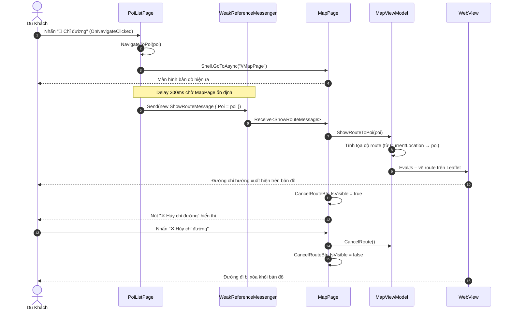
```mermaid
sequenceDiagram
    autonumber
    actor U as Du Khách
    participant LP as PoiListPage
    participant MSG as WeakReferenceMessenger
    participant MP as MapPage
    participant VM as MapViewModel
    participant WV as WebView

    U->>LP: Nhấn "🧭 Chỉ đường" (OnNavigateClicked)
    LP->>LP: NavigateToPoi(poi)
    LP->>MP: Shell.GoToAsync("//MapPage")
    MP-->>U: Màn hình bản đồ hiện ra

    Note over LP,MSG: Delay 300ms chờ MapPage ổn định
    LP->>MSG: Send(new ShowRouteMessage { Poi = poi })

    MSG->>MP: Receive<ShowRouteMessage>
    MP->>VM: ShowRouteToPoi(poi)
    VM->>VM: Tính tọa độ route (từ CurrentLocation → poi)
    VM->>WV: EvalJs – vẽ route trên Leaflet
    WV-->>U: Đường chỉ hướng xuất hiện trên bản đồ

    MP->>MP: CancelRouteBtn.IsVisible = true
    MP-->>U: Nút "✕ Hủy chỉ đường" hiển thị

    U->>MP: Nhấn "✕ Hủy chỉ đường"
    MP->>VM: CancelRoute()
    MP->>MP: CancelRouteBtn.IsVisible = false
    WV-->>U: Đường đi bị xóa khỏi bản đồ
```

---

## UC7: Quét Mã QR – Mở Thuyết Minh (DeepLink)

### Đặc tả

| Trường | Nội dung |
|---|---|
| **Tên Use Case** | Quét mã QR và mở thuyết minh địa điểm |
| **Actor** | Du Khách |
| **Mô tả** | Du khách dùng camera điện thoại quét mã QR tại các bảng thông tin thực địa. Ứng dụng tự mở và phát ngay thuyết minh địa điểm tương ứng. |
| **Định dạng QR** | `vinhkhanh://poi/{poiId}` |
| **Luồng chính** | 1. Camera nhận dạng QR → hệ điều hành gọi App. 2. `DeepLinkHandler.Handle(rawUri)` phân tích URI. 3. `action = "poi"` → gọi `HandlePoiQrAsync(id)`. 4. Chuyển đến `MapPage`. 5. Tìm POI trong `AllPoi`. 6. Nếu có audio → hỏi Display Alert "Tải audio hay dùng TTS?". 7. Phát thuyết minh. 8. Song song gọi `LogQrScanAsync()` và `POST /api/pois/{id}/scan`. |
| **Luồng ngoại lệ** | Không tìm thấy POI trong danh sách → bỏ qua, không phát và không hiển thị lỗi. |

### Sơ đồ Sequence

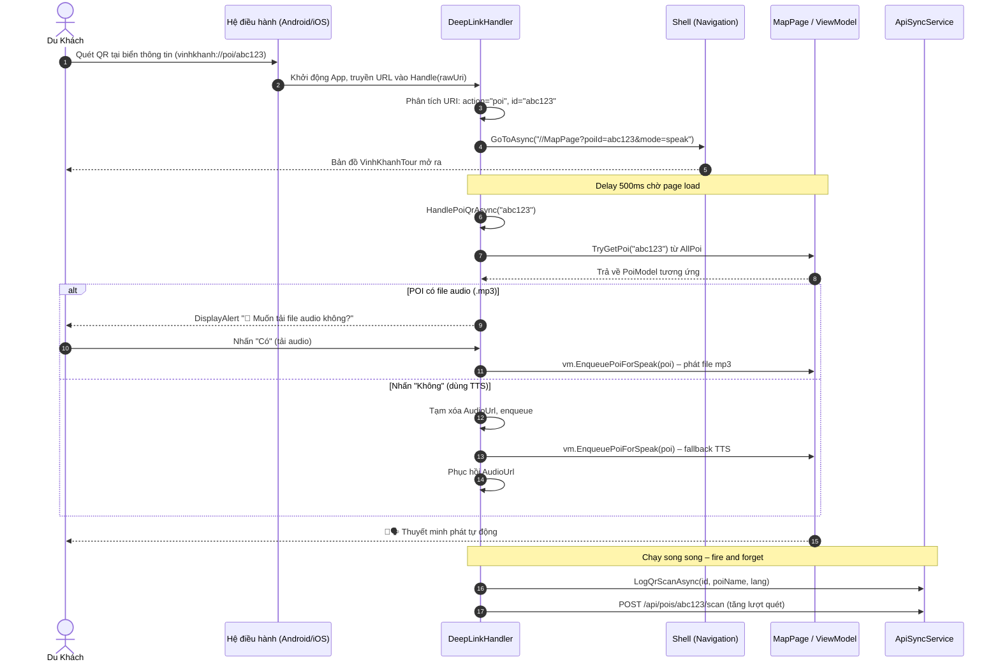
```mermaid
sequenceDiagram
    autonumber
    actor U as Du Khách
    participant OS as Hệ điều hành (Android/iOS)
    participant DL as DeepLinkHandler
    participant SH as Shell (Navigation)
    participant MP as MapPage / ViewModel
    participant API as ApiSyncService

    U->>OS: Quét QR tại biển thông tin (vinhkhanh://poi/abc123)
    OS->>DL: Khởi động App, truyền URL vào Handle(rawUri)
    DL->>DL: Phân tích URI: action="poi", id="abc123"

    DL->>SH: GoToAsync("//MapPage?poiId=abc123&mode=speak")
    SH-->>U: Bản đồ VinhKhanhTour mở ra

    Note over DL,MP: Delay 500ms chờ page load
    DL->>DL: HandlePoiQrAsync("abc123")
    DL->>MP: TryGetPoi("abc123") từ AllPoi
    MP-->>DL: Trả về PoiModel tương ứng

    alt POI có file audio (.mp3)
        DL-->>U: DisplayAlert "🎵 Muốn tải file audio không?"
        U->>DL: Nhấn "Có" (tải audio)
        DL->>MP: vm.EnqueuePoiForSpeak(poi) – phát file mp3
    else Nhấn "Không" (dùng TTS)
        DL->>DL: Tạm xóa AudioUrl, enqueue
        DL->>MP: vm.EnqueuePoiForSpeak(poi) – fallback TTS
        DL->>DL: Phục hồi AudioUrl
    end

    MP-->>U: 🎵🗣️ Thuyết minh phát tự động

    Note over DL,API: Chạy song song – fire and forget
    DL->>API: LogQrScanAsync(id, poiName, lang)
    DL->>API: POST /api/pois/abc123/scan (tăng lượt quét)
```

---

## UC8: Cài Đặt Ứng Dụng

### Đặc tả

| Trường | Nội dung |
|---|---|
| **Tên Use Case** | Cài đặt ứng dụng |
| **Actor** | Du Khách |
| **Mô tả** | Du khách tùy chỉnh trải nghiệm: đổi ngôn ngữ, chọn bán kính nhận diện, tốc độ giọng đọc, số lần lặp audio, thời gian hồi chiêu. |
| **Điều kiện tiền đề** | Đang ở trang `SettingsPage` |
| **Các thiết lập khả dụng** | Ngôn ngữ: VI / EN / ZH / JA / KO. Tốc độ giọng: 0.6x / 1.0x / 1.4x / 1.8x. Số lần lặp: 1-5 lần. Cooldown: 3/10/30/60/120 giây. Bán kính: 10/30/50m hoặc Slider. Test TTS thử giọng. |
| **Luồng chính** | 1. Du khách mở tab Cài đặt → `OnAppearing()` gọi `RefreshLocalizedText()` và `HighlightCurrentLanguage()`. 2. Du khách nhấn chọn ngôn ngữ (VD: 🇬🇧) → `SwitchLanguage(AppLocale.English)` → `LocalizationService.SetLocale()` → sự kiện `LanguageChanged` phát ra toàn App. 3. Chọn tốc độ giọng đọc (🐢/🚶/🚴/🚀) → `SetSpeechRate(rate)` cập nhật static `SpeechRate`. 4. Chọn số lần lặp (1-5) → `SetRepeat(val)` cập nhật static `RepeatCount`. 5. Chọn Cooldown (3/10/30/60/120s) → `SetCooldown(val)` cập nhật static `CooldownSeconds`. 6. Chọn Bán kính nhận diện (10/30/50m hoặc kéo Slider) → `SetRadius(val)` cập nhật static `GlobalRadius`. 7. Nhấn "🔊 Thử giọng" → `TtsService.SpeakAsync()` đọc câu chào bằng ngôn ngữ hiện tại. |
| **Luồng ngoại lệ** | TTS không hoạt động trên thiết bị → `SpeakAsync()` thất bại âm thầm, không hiển thị lỗi với người dùng. Ngôn ngữ thay đổi nhưng POI không có bản dịch → hiển thị chuỗi key gốc hoặc fallback về Tiếng Việt. |

### Sơ đồ Sequence

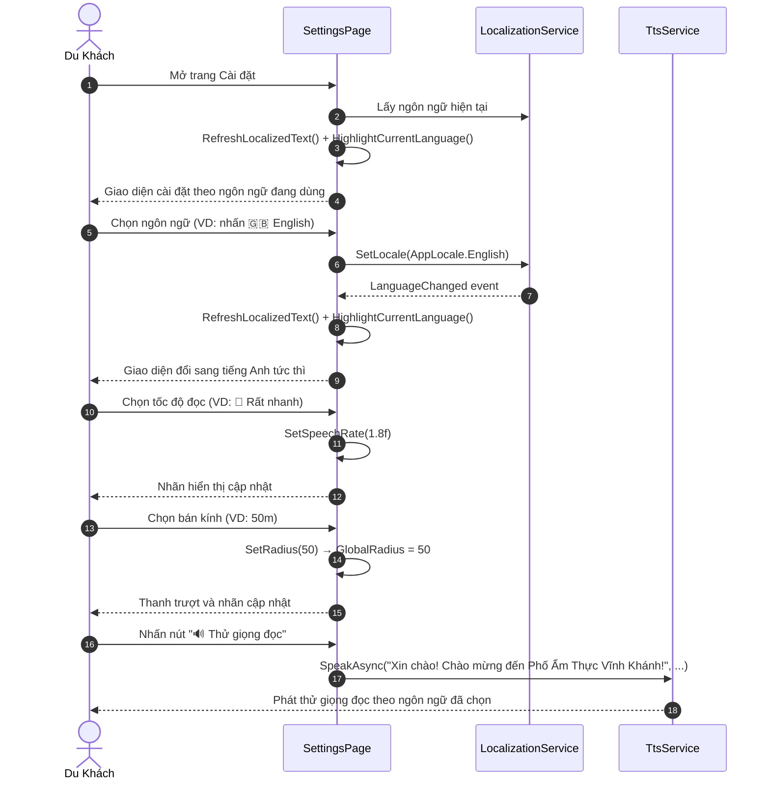
```mermaid
sequenceDiagram
    autonumber
    actor U as Du Khách
    participant SP as SettingsPage
    participant LOC as LocalizationService
    participant TTS as TtsService

    U->>SP: Mở trang Cài đặt
    SP->>LOC: Lấy ngôn ngữ hiện tại
    SP->>SP: RefreshLocalizedText() + HighlightCurrentLanguage()
    SP-->>U: Giao diện cài đặt theo ngôn ngữ đang dùng

    U->>SP: Chọn ngôn ngữ (VD: nhấn 🇬🇧 English)
    SP->>LOC: SetLocale(AppLocale.English)
    LOC-->>SP: LanguageChanged event
    SP->>SP: RefreshLocalizedText() + HighlightCurrentLanguage()
    SP-->>U: Giao diện đổi sang tiếng Anh tức thì

    U->>SP: Chọn tốc độ đọc (VD: 🚀 Rất nhanh)
    SP->>SP: SetSpeechRate(1.8f)
    SP-->>U: Nhãn hiển thị cập nhật

    U->>SP: Chọn bán kính (VD: 50m)
    SP->>SP: SetRadius(50) → GlobalRadius = 50
    SP-->>U: Thanh trượt và nhãn cập nhật

    U->>SP: Nhấn nút "🔊 Thử giọng đọc"
    SP->>TTS: SpeakAsync("Xin chào! Chào mừng đến Phố Ẩm Thực Vĩnh Khánh!", ...)
    TTS-->>U: Phát thử giọng đọc theo ngôn ngữ đã chọn
```
actor A as Quản trị viên
        participant C as CMS_Users
        participant D as UserDialog
        participant U as API
        A->>C: OnInitializedAsync() -> LoadData()
        C->>U: GET api/users
        U-->>C: Array[AppUser]
        A->>C: EditUser(selectedUser)
        C->>D: OpenDialog(UserModel)
        Note over D: Admin chọn ExpiryDate mới
        A->>D: Submit()
        D->>U: POST api/users (SaveUserAsync)
        U-->>D: 200 OK
        D-->>C: Refresh List

